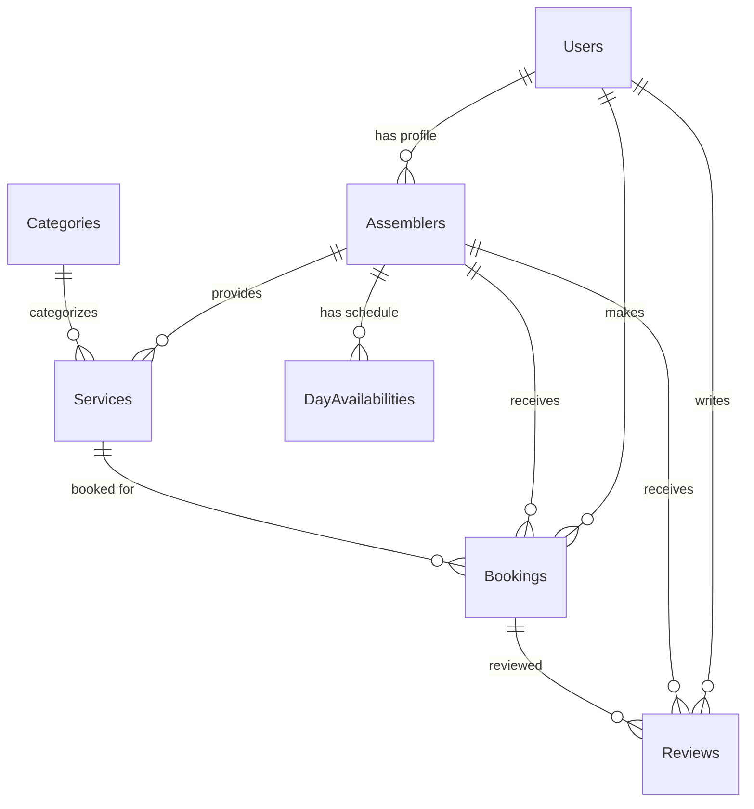

# The Assemblers - Professional Home Services Platform

## 🏗️ Clean Architecture Implementation

This project implements a professional home services platform using Clean Architecture principles with .NET 9.0 Web API and Angular 18 frontend.

## 📁 Project Structure

```
AssemblersApi/
├── Application/                 # Application Layer
│   ├── DTOs/                   # Data Transfer Objects
│   ├── Interfaces/              # Application Service Interfaces
│   └── Services/               # Application Services
├── Domain/                     # Domain Layer
│   ├── Entities/              # Domain Entities
│   ├── Interfaces/            # Repository Interfaces
│   ├── Enums/                 # Domain Enums
│   └── ValueObjects/          # Domain Value Objects
├── Infrastructure/             # Infrastructure Layer
│   ├── Repositories/          # Repository Implementations
│   └── Services/              # Infrastructure Services
├── Data/                      # Data Access Layer
│   └── AssemblersDbContext.cs # Entity Framework Context
├── Controllers/               # API Controllers
└── Program.cs                 # Application Entry Point
```

## 🎯 Clean Architecture Layers

### 1. Domain Layer (`Domain/`)
**Purpose**: Contains the core business logic and entities.

**Key Components**:
- **Entities**: Core business objects (User, Assembler, Service, Booking, Review, Category, DayAvailability)
- **Interfaces**: Repository contracts defining data access operations
- **BaseEntity**: Common properties for all entities (Id, CreatedAt, UpdatedAt, IsDeleted)

**Key Features**:
- ✅ Soft delete support (`IsDeleted` flag)
- ✅ Audit trail (`CreatedAt`, `UpdatedAt`)
- ✅ Proper entity relationships with navigation properties
- ✅ Domain validation attributes

### 2. Application Layer (`Application/`)
**Purpose**: Contains application-specific business logic and use cases.

**Key Components**:
- **DTOs**: Data Transfer Objects for API communication
- **Interfaces**: Application service contracts
- **Services**: Application service implementations

**Key Features**:
- ✅ Separation of concerns between domain and presentation
- ✅ DTO mapping for clean API responses
- ✅ Business logic encapsulation
- ✅ Error handling and validation

### 3. Infrastructure Layer (`Infrastructure/`)
**Purpose**: Implements external concerns like data access and external services.

**Key Components**:
- **Repositories**: Entity Framework implementations of domain interfaces
- **Services**: External service implementations

**Key Features**:
- ✅ Generic repository pattern with `Repository<T>`
- ✅ Specific repository implementations for complex queries
- ✅ Entity Framework Core integration
- ✅ Database query optimization

### 4. Presentation Layer (`Controllers/`)
**Purpose**: Handles HTTP requests and responses.

**Key Components**:
- **API Controllers**: RESTful API endpoints
- **Swagger Integration**: API documentation

**Key Features**:
- ✅ RESTful API design
- ✅ Proper HTTP status codes
- ✅ Error handling and validation
- ✅ Swagger/OpenAPI documentation

## 🗄️ Database Design

### Entity Relationships



### Key Database Features

- ✅ **Soft Delete**: All entities support soft deletion
- ✅ **Audit Trail**: CreatedAt and UpdatedAt timestamps
- ✅ **Foreign Key Constraints**: Proper referential integrity
- ✅ **Indexes**: Optimized for common queries
- ✅ **Seed Data**: Comprehensive test data

## 🚀 API Endpoints

### Users
- `GET /api/users` - Get all users
- `GET /api/users/{id}` - Get user by ID
- `POST /api/users` - Create new user
- `POST /api/users/login` - User login
- `GET /api/users/email-exists/{email}` - Check if email exists

### Assemblers
- `GET /api/assemblers` - Get all assemblers
- `GET /api/assemblers/{id}` - Get assembler by ID
- `POST /api/assemblers` - Create new assembler
- `GET /api/assemblers/by-user/{userId}` - Get assembler by user ID
- `GET /api/assemblers/specialization/{specialization}` - Get by specialization
- `GET /api/assemblers/available` - Get available assemblers

### Services
- `GET /api/services` - Get all services
- `GET /api/services/{id}` - Get service by ID
- `POST /api/services` - Create new service
- `GET /api/services/category/{categoryId}` - Get by category
- `GET /api/services/assembler/{assemblerId}` - Get by assembler
- `GET /api/services/search?q={query}` - Search services

### Bookings
- `GET /api/bookings` - Get all bookings
- `GET /api/bookings/{id}` - Get booking by ID
- `POST /api/bookings` - Create new booking
- `PUT /api/bookings/{id}/status` - Update booking status
- `GET /api/bookings/customer/{customerId}` - Get by customer
- `GET /api/bookings/assembler/{assemblerId}` - Get by assembler
- `GET /api/bookings/availability` - Check availability

### Reviews
- `GET /api/reviews` - Get all reviews
- `GET /api/reviews/{id}` - Get review by ID
- `POST /api/reviews` - Create new review
- `GET /api/reviews/assembler/{assemblerId}` - Get by assembler
- `GET /api/reviews/assembler/{assemblerId}/average-rating` - Get average rating

### Categories
- `GET /api/categories` - Get all categories
- `GET /api/categories/{id}` - Get category by ID
- `POST /api/categories` - Create new category

## 🔧 Technical Features

### Backend (.NET 9.0)
- ✅ **Clean Architecture**: Proper separation of concerns
- ✅ **Entity Framework Core**: Code-first approach with migrations
- ✅ **Repository Pattern**: Generic and specific repositories
- ✅ **Dependency Injection**: Built-in DI container
- ✅ **CORS Support**: Cross-origin resource sharing
- ✅ **Swagger Integration**: API documentation
- ✅ **Soft Delete**: Non-destructive data removal
- ✅ **Audit Trail**: Automatic timestamp tracking
- ✅ **Password Hashing**: Secure password storage
- ✅ **Input Validation**: Data annotation validation

### Frontend (Angular 18)
- ✅ **Standalone Components**: Modern Angular architecture
- ✅ **TypeScript**: Type-safe development
- ✅ **SCSS**: Advanced styling capabilities
- ✅ **HTTP Client**: API communication
- ✅ **Reactive Forms**: Form handling
- ✅ **Routing**: Single-page application navigation
- ✅ **Responsive Design**: Mobile-first approach
- ✅ **Error Handling**: User-friendly error messages
- ✅ **Loading States**: Better user experience

## 📊 Seed Data

The application includes comprehensive seed data:

### Categories (5)
- Furniture Assembly
- Electronics Setup
- Home Improvement
- Computer Services
- Smart Home

### Users (5)
- 2 Customers (John Smith, Sarah Johnson)
- 3 Assemblers (Mike Wilson, Lisa Brown, David Lee)

### Assemblers (3)
- Mike Wilson: Electronics Setup specialist
- Lisa Brown: Electronics Setup specialist
- David Lee: Computer Assembly specialist

### Services (8)
- IKEA Furniture Assembly
- Office Furniture Setup
- TV Mounting
- Home Theater Setup
- Custom PC Build
- Laptop Repair
- Smart Home Setup
- General Assembly

### Day Availabilities (15)
- Each assembler has Monday-Friday availability (9 AM - 5 PM)

## 🚀 Getting Started

### Prerequisites
- .NET 9.0 SDK
- Node.js 18+
- SQL Server (or Azure SQL Database)
- Visual Studio Code or Rider

### Backend Setup
```bash
cd AssemblersApi
dotnet restore
dotnet ef database update
dotnet run
```

### Frontend Setup
```bash
cd /Users/airm2/the-assemblers1
npm install
ng serve
```

### Access Points
- **API**: http://localhost:5161
- **Swagger**: http://localhost:5161/swagger
- **Frontend**: http://localhost:4200

## 🔒 Security Features

- ✅ **Password Hashing**: SHA256 hashing for passwords
- ✅ **CORS Configuration**: Controlled cross-origin access
- ✅ **Input Validation**: Server-side validation
- ✅ **SQL Injection Protection**: Entity Framework parameterized queries
- ✅ **Soft Delete**: Data retention for audit purposes

## 📈 Performance Optimizations

- ✅ **Database Indexes**: Optimized for common queries
- ✅ **Lazy Loading**: Efficient data loading
- ✅ **Repository Pattern**: Reduced database calls
- ✅ **DTO Mapping**: Minimal data transfer
- ✅ **Connection Pooling**: Efficient database connections

## 🧪 Testing Strategy

### Backend Testing
- Unit tests for services and repositories
- Integration tests for API endpoints
- Database migration testing

### Frontend Testing
- Component unit tests
- Service integration tests
- End-to-end testing

## 📝 Future Enhancements

### Planned Features
- [ ] **Authentication & Authorization**: JWT-based authentication
- [ ] **Real-time Notifications**: SignalR integration
- [ ] **Payment Integration**: Stripe/PayPal integration
- [ ] **File Upload**: Image and document handling
- [ ] **Email Service**: Notification emails
- [ ] **Mobile App**: React Native or Flutter
- [ ] **Admin Dashboard**: Management interface
- [ ] **Analytics**: Usage tracking and reporting

### Technical Improvements
- [ ] **Caching**: Redis integration
- [ ] **Logging**: Structured logging with Serilog
- [ ] **Monitoring**: Application insights
- [ ] **CI/CD**: Automated deployment pipeline
- [ ] **Docker**: Containerization
- [ ] **Microservices**: Service decomposition

## 🤝 Contributing

1. Fork the repository
2. Create a feature branch
3. Implement changes following clean architecture principles
4. Add tests for new functionality
5. Submit a pull request

## 📄 License

This project is licensed under the MIT License.

---

## 🎯 Architecture Benefits

### Maintainability
- Clear separation of concerns
- Easy to understand and modify
- Consistent code organization

### Testability
- Dependency injection enables easy mocking
- Isolated business logic
- Comprehensive test coverage

### Scalability
- Modular architecture
- Easy to add new features
- Performance optimizations

### Flexibility
- Technology-agnostic domain layer
- Easy to swap implementations
- Future-proof design

This clean architecture implementation provides a solid foundation for a professional home services platform that can scale and evolve with business needs.
